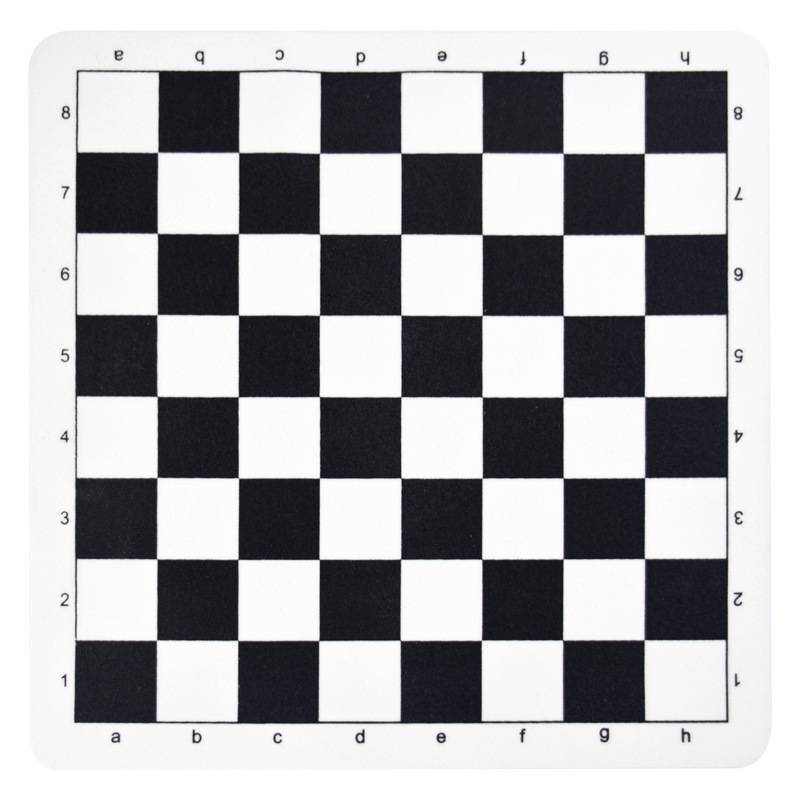

# PB162 seminar project

## Objectives
* Definition of well-encapsulated classes
* Object construction and cooperation
* OO decomposition of the terms of the application domain. 

## Tasks
In this iteration, we aim to introduce basic classes reflecting the application domain:
Two players play a game by putting pieces on a chessboard positions.

Unless otherwise instructed, create new classes/enums in the `cz.muni.fi.pb162.project` package.

1. Desktop games are played by players. Therefore, create the `Player` class.
   - Every player has a `name`. 
   - The name is assigned when the player is created and never changes.
   - Anybody can ask for the player's name.
2. Chessboard games are based on moving pieces of different types on the board. Therefore, introduce the `Piece` class
   that represents a generic piece of a game. Later, we will create specific types, e.g., king or knight.
   - Keep the code as simple as possible. Do we need to add a constructor?
     > Consider the meaningfulness of having "empty" classes in the code. Be aware that neither class/object is empty! 
3. Create the `Board` class representing a chessboard.
   - The board is always square. The size is set during the construction.
   - The board consists of a two-dimensional _array of pieces_. Initially, the board is empty (no pieces are on it). 
   - Positions of pieces on the board are used to be referred to as the combination of a letter and a number from 1, e.g., a1, b6, etc.,
     where the letter refers to the column while the number refers to the line (see figure below).
     However, the real positions of pieces in the array are stored under indexes from 0. 
     Therefore, create the `Position` class capturing and converging these value pairs:
     - Add a constructor that takes a _column_ and a _line_ as real positions (integers starting from 0).
       Use exactly these names and order of arguments.
     - Add getters for these values.
     - Add an overload constructor that takes the column as a letter (type `char`) and the line as an integer starting from 1.
       > Review rules for overload constructors and methods. See hints below for char <-> int conversion.
     - In the later constructor, use a mutual invocation of constructors.
       > Use `columnChar - 97` to convert char into an integer, where 97 is the UNICODE of the 'a' letter.
     - Add a `toString()` method that returns a human-readable position, e.g., "a1".
       >  Use `(char) (columnInt + 97)` to convert line integer back to char, where 97 is the UNICODE of the 'a' letter.
   - Add the `getSize()` method returning board's size.
   - Add public methods to the `Board` that will be used to find suitable moves for the pieces on the board.
     - The `inRange` method takes the position of a piece as an input parameter and returns `false` if the position 
       is out of the bounds of the board. Otherwise, it returns `true`.
     - The `isEmpty` method takes the position of a piece as an input parameter and returns `true` if there is no piece
       at the given position or the position is out of the board (see `inRange`). Otherwise, it returns `false`.
       Avoid code duplicity by re-using previous methods.
     - The `getPiece` method takes the position of a piece as an input parameter and returns the piece at the position.
       The method returns "no object" if there is no piece at the given position or the position is out of the board.
       Avoid code duplicity by re-using previous methods.
     - The `putPieceOnBoard` method takes position and piece as input parameters and puts the piece on the board.
       If the position is occupied, then the method replaces the original piece.
4. Edit the executable class Main.
     - Move the class into the `demo` sub-package of `cz.muni.fi.pb162.project`.
     - Remove the print statement for Hello World.
     - Create a new player. Set the name to "Matko" and print the name to standard output using the player's methods.
     - Create a 8x8 board with two pieces, the first at the position "a8", and the second at "e1".
5. Document your code by Javadoc. To ensure that the implementation is correct, run `mvn clean install` from the 
   command line (or set Maven run config in IDEA with these commands). This command checks not only the 
   correctness of your code (syntax), but also runs unit tests and style checks.

## Takeaways
* Set necessary attributes during object instantiation, i.e., by providing proper (and often multiple) constructors.
* Call existing constructors from overloaded constructors whenever possible. Doing that localizes changes,
  makes the code shorter, and then supports code _maintainability_ - a key goal of OO decomposition.
* Create small objects with narrow responsibilities (attributes and methods) and let them communicate. 
  For example, our blackboard is split into three classes: `Blackboard`, `Position`, and `Piece`.
  Functionality, e.g., putting a piece on the blackboard's position, is backed by mutual communication 
  of the corresponding instances. Following these principles support code _maintainability_.
* Methods exposing the _state of an object_ by providing a value of a distinct attribute are called _getters_.
  Their naming and documentation should follow specific rules. Similarly, methods attribute values (and then 
  changing the state) are called _setters_.

## Features to be manually checked by tutors 
* JavaDoc documentation.
* Mutual call of `Position` constructors.
* The code in the `Main` method.

